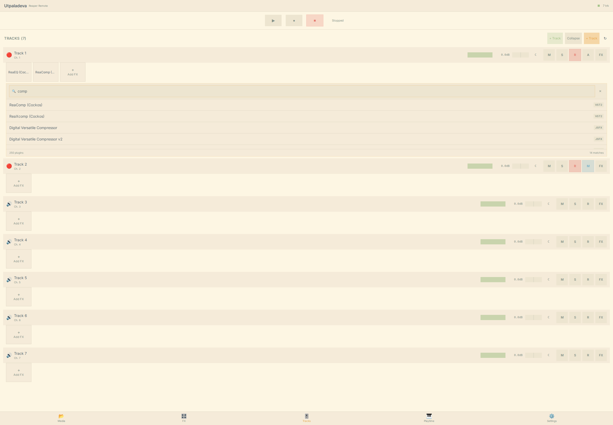
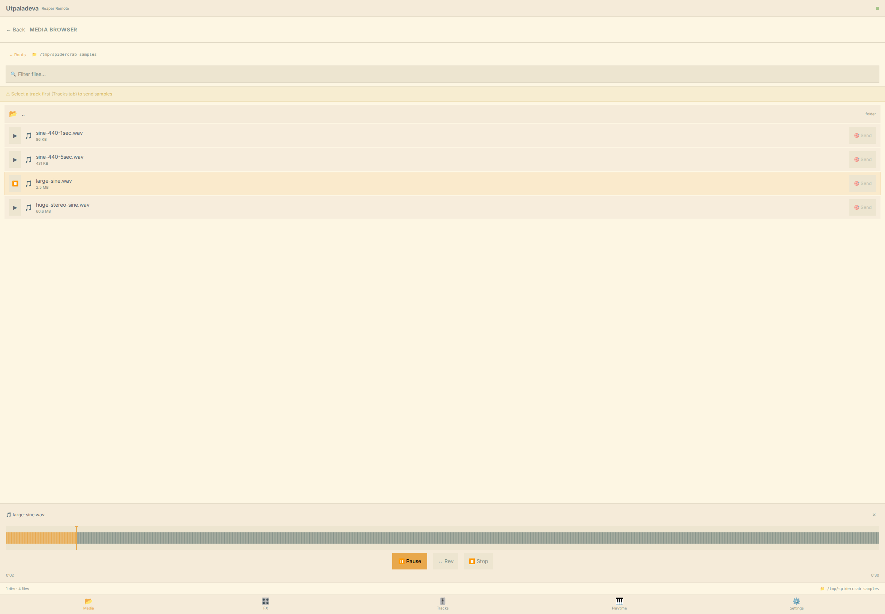
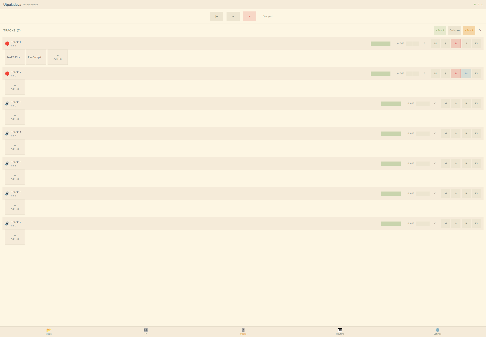

# 🦀 spidercrab

<div align="center">
  
  <br/>
  <em>Fig. 1. The Spiny Spider-crab (<i>Maia squinado</i>), our namesake.</em>
</div>

**Turn your iPad into a hands-on remote for REAPER.** Launch clips, play and record, shape effects, and drop in samples, all by touch, over your own Wi-Fi.

<div align="center">
  <table>
    <tr>
      <td></td>
      <td></td>
    </tr>
    <tr>
      <td></td>
      <td></td>
    </tr>
  </table>
</div>

## What it does

Spidercrab adds a touch control surface to REAPER that you open on an iPad, or any tablet. No cloud, no subscription, no second computer. Once it is running you can:

- Mix by touch, with volume, pan, mute, solo and record-arm on every track.
- Play, stop and record, and fire off clips and scenes with Playtime 2.
- Add effects and effect chains, and tune their parameters on large, finger-friendly sliders.
- Browse, tag and preview your samples, then send them to a track or a clip.
- Program patterns in a step sequencer and bounce them to clips.

It reads clearly in both light and dark.

## Getting started

1. Copy the plugin for your system into REAPER's UserPlugins folder, and place the `frontend` folder next to it.
2. Restart REAPER.
3. On your iPad, open the address REAPER is serving, then add it to your home screen.

That is enough for track, effect and sample control. The clip launcher adds Playtime 2 and a short, one-time setup.

**Full walkthrough: [Getting Started](docs/getting-started.md).**

Nothing else is required. No SWS, no scripts, no other REAPER add-ons. The only extra piece is Helgobox, and only if you want the clip launcher.

## Documentation

The complete guide lives in [`docs/`](docs/) and covers every tab, every gesture, and setup from scratch:

- [Getting Started](docs/getting-started.md)
- [Touch Gestures](docs/gestures.md)
- [A tour of the five tabs](docs/features/README.md)

Read it on GitHub, or build the searchable site locally with `mkdocs serve` (dependencies in [`docs/requirements.txt`](docs/requirements.txt)).

## Status

Spidercrab is early software under active development. Keep backups, and see the [open issues](https://github.com/quantockhills/spidercrab/issues) for current limitations before you lean on it in a live session.

## For developers

```bash
git clone https://github.com/quantockhills/spidercrab.git
cd spidercrab
make build          # build the extension plugin
make deploy         # copy the plugin into REAPER (plugin only)
cd frontend && npm run build   # build the web UI
```

`make deploy` installs the **plugin** only. To deploy the **web UI**, copy the built `frontend/dist` output into a folder named **`frontend`** next to the plugin in UserPlugins. The plugin serves `<plugin folder>/frontend/index.html`, so the folder must be named `frontend` (not `dist`), with `index.html` at its root. For live UI work, `npm run dev` runs a hot-reloading dev server instead.

On Windows the plugin is built with **clang-cl** (or MSVC), never MinGW. Architecture and build notes are in [`docs/`](docs/).

## License

MIT. See [LICENSE](LICENSE).
