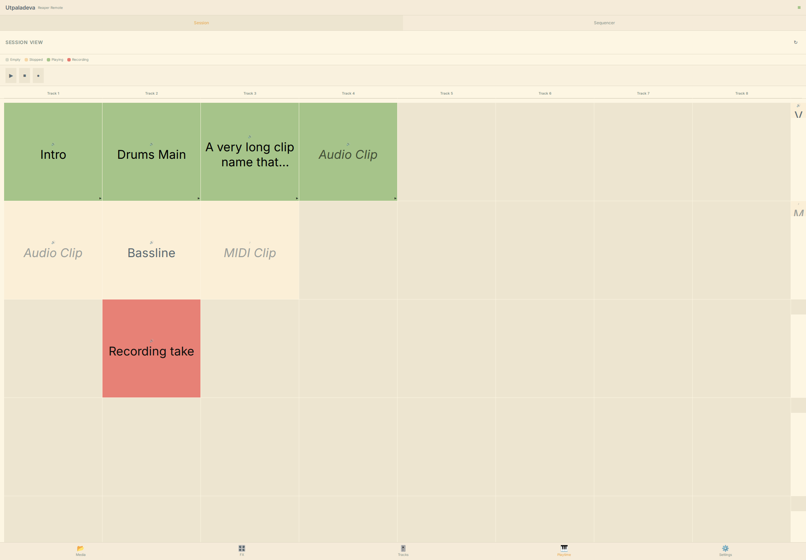
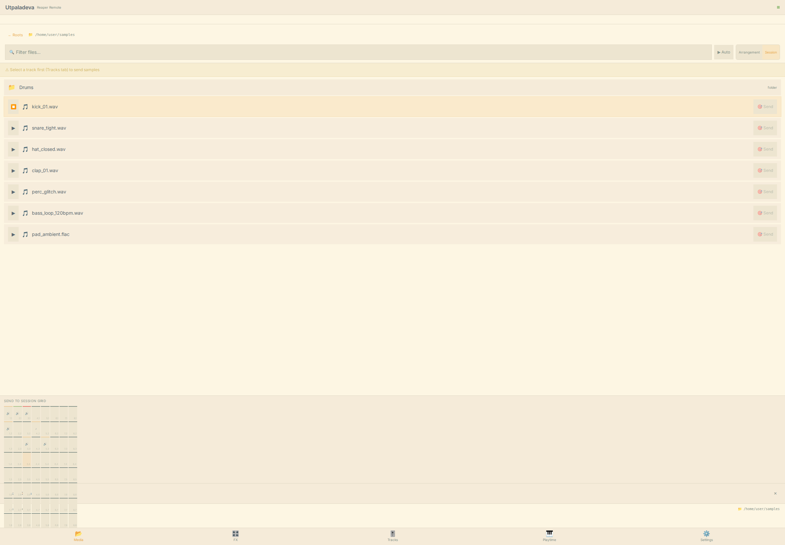

# 🦀 spidercrab

> ⚠️ **Work in progress.** This is an early-stage project under active development. It may crash, eat your project file, or set your cat on fire. Not yet recommended for live use or critical sessions. Proceed with caution (and backups).

**Control REAPER from your iPad** — browse FX, tweak parameters, manage tracks, all over WiFi. No extra servers, no subscription, no cloud.

<div align="center">
  <table>
    <tr>
      <td></td>
      <td></td>
    </tr>
    <tr>
      <td></td>
      <td></td>
    </tr>
  </table>
</div>

## What is this?

An extension that turns REAPER into a WiFi-enabled DAW you can control from an iPad (or any phone/tablet). It runs a tiny web server inside REAPER — open the address on your iPad and you get a touch-friendly control surface with:

- **Track overview** — see all your tracks, mute/solo/arm, adjust volume
- **FX browser** — browse 250+ plugins, search, filter by format
- **Param control** — touch sliders for every FX parameter, real-time feedback
- **FX chains** — save and load `.RfxChain` files with tag filtering
- **Sample browser** — browse your sample library, tag files, preview audio, send to tracks or Playtime 2 slots with automatic tempo matching
- **Tags** — organize FX, chains, and samples with custom labels, filter by tag

No Node.js, no separate server process, no cloud. Works on your local network.

## 📱 How to use it

### 1. Install the extension
Download the latest release for your OS from the [releases page](https://github.com/quantockhills/spidercrab/releases):

- **Windows** → `reaper_spidercrab.dll` into `REAPER/UserPlugins/`
- **Linux** → `reaper_spidercrab.so` into `REAPER/UserPlugins/`
- **macOS** → `reaper_spidercrab.dylib` into `REAPER/UserPlugins/`

Then copy the **`frontend/`** folder into the same directory (next to the .dll/.so).

### 2. Launch REAPER
The extension starts automatically — you'll see `WebSocket server started on port 9224` in the console.

### 3. Open on your iPad
Open `http://your-computer-name:5173` in Safari (or any browser) on your iPad. Add it to your home screen for a full-screen PWA experience.

That's it. No configuration needed.

## ✨ What's included

| Area | What you can do |
|------|----------------|
| **Tracks** | See all tracks, mute/solo/arm, record mode (audio/MIDI), volume, pan |
| **FX** | Browse all installed plugins, search, filter by format, **tag** with colored badges |
| **Parameters** | Touch sliders for every FX parameter with real-time updates, presets |
| **FX Chains** | Browse, save, load `.RfxChain` files with **cached in-memory search** |
| **Inline FX search** | Long-press on a track card to search and add FX or chains |
| **Tags** | Label FX, chains, and samples with custom tags; filter by tag |
| **FX reorder** | Drag-and-drop to reorder FX on a track |
| **FX bypass/delete** | Tap to bypass, long-press to delete |
| **Sample browser** | Multi-root, persistent cache, audio preview, waveform, tags |
| **Sample → track** | Send sample to any track with one tap |
| **Sample → Playtime** | Send sample to Playtime slot with **MiniBPM tempo matching** |
| **Playtime grid** | Full clip launcher — launch/stop clips, scenes, record, clip names |
| **Track controls on grid** | Mute/solo/arm/volume per Playtime column, Go to Track nav |
| **Transport** | Play, Stop, Record |
| **Everforest Light** | Warm pastel theme — no dark mode, no pure black/white |

## 🎵 Playtime 2 Clip Launcher

Spidercrab has a **clip launcher** mode for triggering and recording audio/MIDI clips via [Playtime 2](https://www.helgoboss.org/projects/playtime-2/). Communication happens over **OSC (Open Sound Control) via UDP** — fast, event-driven, no polling.

### Setup (under 2 minutes)

#### 1. Install ReaLearn + Playtime 2

Download and install the [Helgobox](https://www.helgoboss.org/projects/helgobox/) package (contains both ReaLearn and Playtime 2):

1. Download the latest `helgobox-*-x86_64.pkg` (macOS) or `helgobox-*-win64.exe` (Windows) or `helgobox-*-linux-x86_64.tar.xz` (Linux)
2. Run the installer — it will place files in your REAPER `UserPlugins/` and `Effects/` directories
3. Restart REAPER
4. Verify: you should see "Helgobox" under **FX** → **Helgobox** → **ReaLearn**

#### 2. Add ReaLearn to a track

1. Insert ReaLearn on any track (or as monitoring FX)
2. Open the ReaLearn window (click the FX button on the track)
3. Go to the **Main** compartment tab

#### 3. Import the spidercrab preset

1. In the spidercrab web UI, go to **Settings** → **Playtime 2** → click **↓ Download ReaLearn Preset**
2. Open the downloaded `.lua` file in a text editor and copy all the contents
3. In ReaLearn's **Main** compartment, click the menu (three dots) → **Import from Lua**
4. Paste the copied text and confirm

This preset creates OSC-to-Playtime mappings for an 8×8 grid of slots.

#### 4. Configure the OSC device in ReaLearn

1. In ReaLearn, go to **Preferences** → **OSC devices**
2. Click **Add OSC device**
3. Give it a name (e.g., "spidercrab")
4. Set **Control input** to listen on port **9001** (spidercrab sends triggers here)
5. Set **Feedback output** address to `127.0.0.1` port **9011** (spidercrab listens for state here)
6. Save the device
7. In the **Main** compartment, select this device as both **Control input** and **Feedback output**

#### 5. Verify it works

1. Make sure Playtime 2 has a matrix with clips loaded
2. Open the spidercrab web UI on your iPad
3. Go to the **Matrix** view
4. Tap a slot — it should trigger the corresponding clip in Playtime 2
5. The slot state (playing/stopped/recording) should update on your iPad in real time

### OSC Address Reference

| Message | Address | Args | Description |
|---------|---------|------|-------------|
| Trigger slot | `/playtime/slot/<col>/<row>/trigger` | none | Play/stop slot at (col, row) |
| Record slot | `/playtime/slot/<col>/<row>/record` | none | Start/stop recording in slot at (col, row) |
| Trigger scene | `/playtime/scene/<row>/trigger` | none | Play/stop scene at row |
| Slot state (feedback) | `/playtime/slot/state` | `iiiis` (col, row, stateId, flags, stateName) | Sent by ReaLearn on port 9011 |

State IDs: `0=stopped`, `1=playing`, `2=recording`, `3=empty`, `4=queued`

### Troubleshooting

| Symptom | Likely cause | Fix |
|---------|-------------|-----|
| No response when tapping a slot | OSC device not configured | Check ReaLearn OSC device settings (step 4) |
| Slot triggers work but state doesn't update | Feedback not reaching spidercrab | Verify Feedback output points to `127.0.0.1:9011` |
| "OSC receiver bind failed" in console | Port 9011 in use by another app | Kill the conflicting app or change spidercrab's receiver port |
| Clips don't play | Playtime 2 not running | Open Playtime 2 window and create a matrix |
| Triggers work but state doesn't update | ReaLearn feedback output misconfigured | Set feedback output to `127.0.0.1:9011` |
| `make test` fails with OSC tests | Linker issues with Berkeley sockets | Add `-lws2_32` on Windows or ensure `#include <sys/socket.h>` works |

## 🎛️ Sample Browser

The sample browser lets you navigate your local sample library, preview audio, tag files, and send samples directly to tracks or Playtime 2 slots.

### Setup

1. Go to **Settings** → **Sample paths** and add one or more root directories
2. Click **⟳** to scan — the extension indexes all audio files in the background
3. Navigate to **Media** tab on your iPad

### Features

- **Persistent cache** — directory listings are cached in the browser's localStorage and survive REAPER restarts. First visit to a folder may be slow on network drives; every visit after is instant.
- **Audio preview** — tap a file to preview it; toggle autoplay in the toolbar
- **Tags** — long-press (or right-click) any file to add tags. Tags persist to `UserPlugins/sample_tags.json` and survive restarts.
- **Global tag filter** — home screen shows all tags across all folders; tap a tag to see every file with that tag regardless of location
- **Tempo matching** — when sending to a Playtime 2 slot, playrate is set automatically so the sample plays at project tempo. Clip length is snapped to the nearest whole bar (within 10%).
- **REAPER Media Explorer libraries** — any `.ReaperFileList` databases configured in REAPER appear as a Libraries section on the home screen

### Note on filenames

Filenames with accented or non-ASCII characters (e.g. `é`, `ñ`, `ü`) are fully supported. If you have samples with such names that fail to load in older versions, they will work correctly with the current build.

## 🔧 For developers

See the [docs/](docs/) folder for architecture, UI spec, and build instructions. Quick start:

```bash
git clone https://github.com/quantockhills/spidercrab.git
cd spidercrab
make build           # Build C++ extension
make deploy          # Copy to REAPER
cd frontend && npm run dev   # Frontend dev server
```

## 📸 Screenshots

The gallery above shows the current UI. For more per-issue galleries, see the [GitHub screenshots folder](https://github.com/quantockhills/spidercrab/tree/master/screenshots) and [`gui_testing/`](gui_testing/) including:
- Unified FX + chain search and inline search
- Tag badges and editor
- Multi-root sample browser with waveform preview
- Playtime grid with clip names and track controls
- FX reorder, preset browser, bypass/delete
- Record mode (audio/MIDI toggle)
- Go to Track navigation
- And more from the full Phase 1 MVP pipeline

## License

MIT — see [LICENSE](LICENSE) file.
