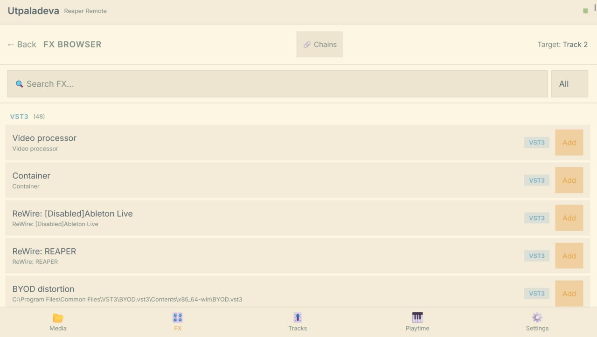
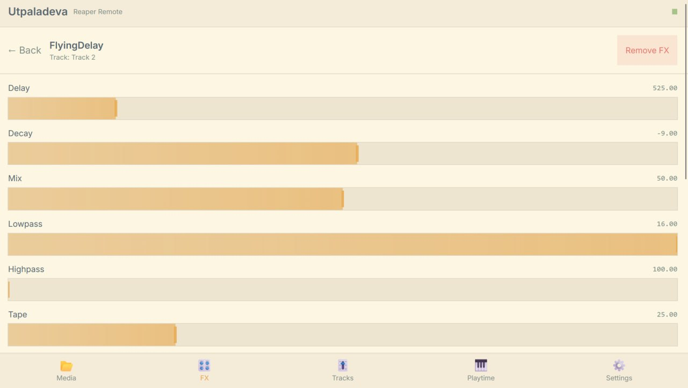
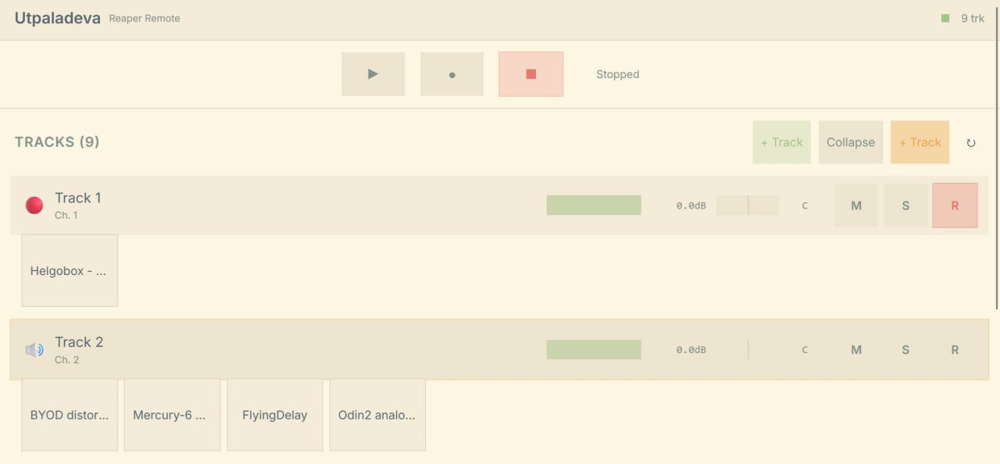
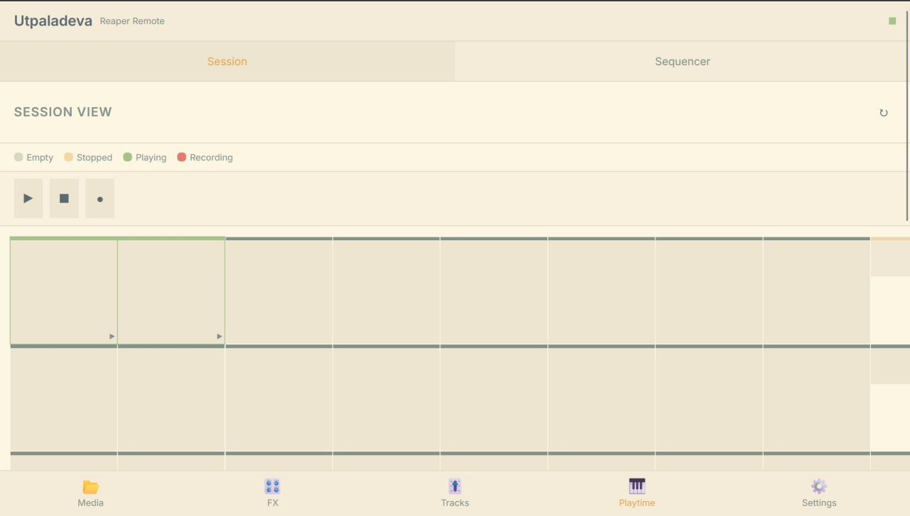

# 🦀 spidercrab

> ⚠️ **Work in progress.** This is an early-stage project under active development. It may crash, eat your project file, or set your cat on fire. Not yet recommended for live use or critical sessions. Proceed with caution (and backups).

**Control REAPER from your iPad** — browse FX, tweak parameters, manage tracks, all over WiFi. No extra servers, no subscription, no cloud.

<div align="center">
  <table>
    <tr>
      <td></td>
      <td></td>
    </tr>
    <tr>
      <td></td>
      <td></td>
    </tr>
  </table>
</div>

## What is this?

An extension that turns REAPER into a WiFi-enabled DAW you can control from an iPad (or any phone/tablet). It runs a tiny web server inside REAPER — open the address on your iPad and you get a touch-friendly control surface with:

- **Track overview** — see all your tracks, mute/solo/arm, adjust volume
- **FX browser** — browse 250+ plugins, search, filter by format
- **Param control** — touch sliders for every FX parameter, real-time feedback
- **FX chains** — save and load `.RfxChain` files with tag filtering
- **Tags** — organize FX and chains with custom labels, filter by tag

No Node.js, no separate server process, no cloud. Works on your local network.

## 📱 How to use it

### 1. Install the extension
Download the latest release for your OS from the [releases page](https://github.com/quantockhills/spidercrab/releases/tag/v0.2.2-alpha):

- **Windows** → `spidercrab.dll` into `REAPER/UserPlugins/`
- **Linux** → `spidercrab.so` into `REAPER/UserPlugins/`

Then copy the **`frontend/`** folder into the same directory (next to the .dll/.so).

### 2. Launch REAPER
The extension starts automatically — you'll see `WebSocket server started on port 9224` in the console.

### 3. Open on your iPad
Open `http://your-computer-name:5173` in Safari (or any browser) on your iPad. Add it to your home screen for a full-screen PWA experience.

That's it. No configuration needed.

## ✨ What's included

| Area | What you can do |
|------|----------------|
| **Tracks** | See all tracks, mute/solo/arm, adjust volume and pan |
| **FX** | Browse all installed plugins, search by name, filter by VST3/VST2/JSFX/CLAP |
| **Parameters** | Touch sliders for every FX parameter with real-time updates |
| **FX Chains** | Browse, save, and load `.RfxChain` files from your iPad |
| **Tags** | Label FX and chains with custom tags, filter by tag |
| **Transport** | Play/Stop from iPad |
| **Dark mode** | Toggle between light and dark themes |
| **FX presets** | Browse and apply presets from the param view |

## 🎵 Playtime 2 Clip Launcher

Spidercrab has a **clip launcher** mode for triggering and recording audio/MIDI clips via [Playtime 2](https://www.helgoboss.org/projects/playtime-2/). Communication happens over **OSC (Open Sound Control) via UDP** — fast, event-driven, no polling.

### Setup (under 2 minutes)

#### 1. Install ReaLearn + Playtime 2

Download and install the [Helgobox](https://www.helgoboss.org/projects/helgobox/) package (contains both ReaLearn and Playtime 2):

1. Download the latest `helgobox-*-x86_64.pkg` (macOS) or `helgobox-*-win64.exe` (Windows) or `helgobox-*-linux-x86_64.tar.xz` (Linux)
2. Run the installer — it will place files in your REAPER `UserPlugins/` and `Effects/` directories
3. Restart REAPER
4. Verify: you should see "Helgobox" under **FX** → **Helgobox** → **ReaLearn**

#### 2. Add ReaLearn to a track

1. Insert ReaLearn on any track (or as monitoring FX)
2. Open the ReaLearn window (click the FX button on the track)
3. Go to the **Main** compartment tab

#### 3. Import the spidercrab preset

1. Open `docs/realearn-presets/spidercrab-playtime.lua` from the spidercrab repo
2. Copy the entire file contents
3. In ReaLearn's **Main** compartment, click the menu (three dots) → **Import**
4. Paste the Lua code and confirm

This preset creates OSC-to-Playtime mappings for an 8×8 grid of slots.

#### 4. Configure the OSC device in ReaLearn

1. In ReaLearn, go to **Preferences** → **OSC devices**
2. Click **Add OSC device**
3. Give it a name (e.g., "spidercrab")
4. Set **Control input** to listen on port **9001** (or any free port)
5. Set **Feedback output** address to `127.0.0.1` port **9000**
6. Save the device
7. In the **Main** compartment, select this device as both **Control input** and **Feedback output**

#### 5. Configure spidercrab to send to the right port

By default, spidercrab sends OSC to `127.0.0.1:9000`. If you configured ReaLearn on port 9001:

- The OSC sender port is configurable in `extension/src/osc_sender.h` (default: 9000)
- The OSC receiver listens on port 9000 for feedback from ReaLearn

For now, you can either:
- Configure ReaLearn to listen on port 9000 (easiest)
- Or change the sender port in the C++ code

#### 6. Verify it works

1. Make sure Playtime 2 has a matrix with clips loaded
2. Open the spidercrab web UI on your iPad
3. Go to the **Matrix** view
4. Tap a slot — it should trigger the corresponding clip in Playtime 2
5. The slot state (playing/stopped/recording) should update on your iPad in real time

### OSC Address Reference

| Message | Address | Args | Description |
|---------|---------|------|-------------|
| Trigger slot | `/playtime/slot/<col>/<row>/trigger` | none | Play/stop slot at (col, row) |
| Record slot | `/playtime/slot/<col>/<row>/record` | none | Start/stop recording in slot at (col, row) |
| Trigger scene | `/playtime/scene/<row>/trigger` | none | Play/stop scene at row |
| Slot state (feedback) | `/playtime/slot/state` | `iiiis` (col, row, stateId, flags, stateName) | Sent by ReaLearn |

State IDs: `0=stopped`, `1=playing`, `2=recording`, `3=empty`, `4=queued`

### Troubleshooting

| Symptom | Likely cause | Fix |
|---------|-------------|-----|
| No response when tapping a slot | OSC device not configured | Check ReaLearn OSC device settings (step 4) |
| Slot triggers work but state doesn't update | Feedback not reaching spidercrab | Verify Feedback output points to `127.0.0.1:9000` |
| "OSC receiver bind failed" in console | Port 9000 in use by another app | Kill the conflicting app or change spidercrab's receiver port |
| Clips don't play | Playtime 2 not running | Open Playtime 2 window and create a matrix |
| Only MIDI works, not OSC | Extension running old MIDI-only code | Rebuild extension from latest source |
| `make test` fails with OSC tests | Linker issues with Berkeley sockets | Add `-lws2_32` on Windows or ensure `#include <sys/socket.h>` works |

## 🔧 For developers

See the [docs/](docs/) folder for architecture, UI spec, and build instructions. Quick start:

```bash
git clone https://github.com/quantockhills/spidercrab.git
cd spidercrab
make build           # Build C++ extension
make deploy          # Copy to REAPER
cd frontend && npm run dev   # Frontend dev server
```

## 📸 Screenshots

See the [screenshots](screenshots/) folder for more, including:
- Unified FX + chain search ([issue #96](screenshots/issue96/))
- Tag badges and editor ([issue #97](screenshots/issue97/))

## License

MIT — see [LICENSE](LICENSE) file.
